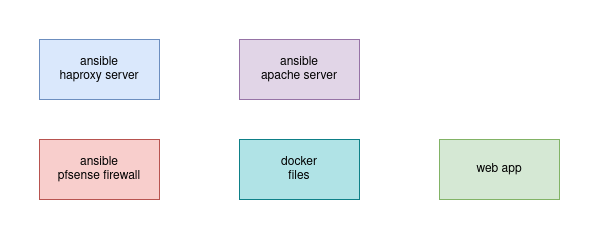
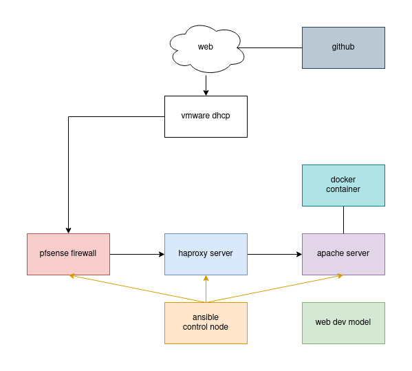

# Contents

* [Introduction](#introduction)
* [About this Repository](#about-this-repository)

# Introduction

This project aims at modeling a CI/CD pipeline. 

## About this Repository

Each part of the project can be found in a different branch of this repository. 
Each branch contains a README.md file with more details.

* `web-dev-model` represents a developer working on a web application.
* TODO: ansible haproxy server
* TODO: ansible apache server
* TODO: ansible pfsense firewall
* TODO: docker files

## Architecture

The main goal of this project is the integration of a CI/CD pipeline. 
Thus, the network architecture and software development are kept to a minimum. 
 
Using Ansible I set up in a local network a firewall, a reverse-proxy and a web server. 
The so-called web application runs in a container.

